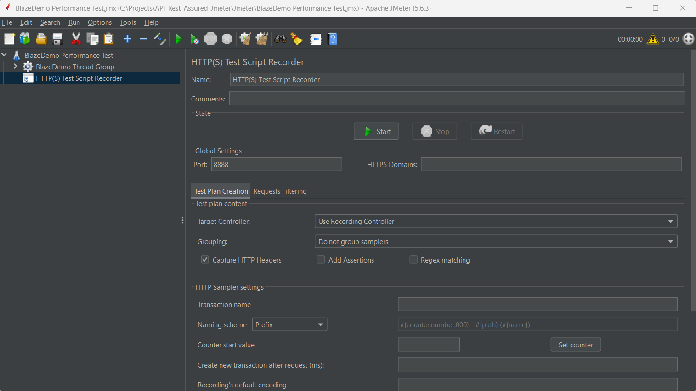
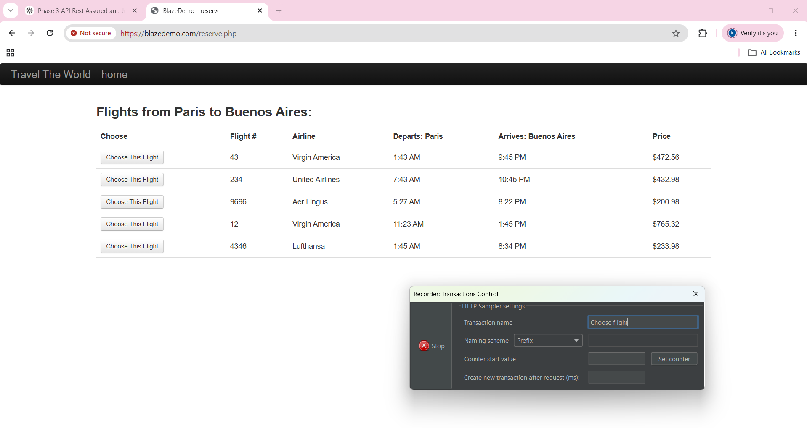
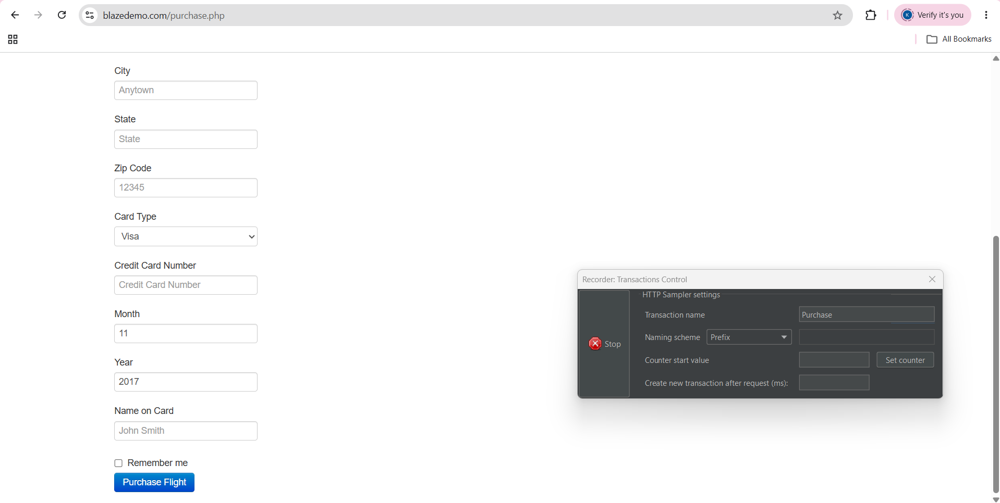
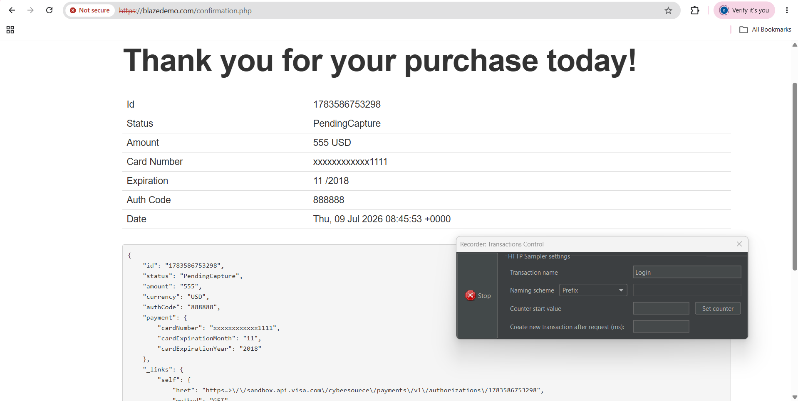
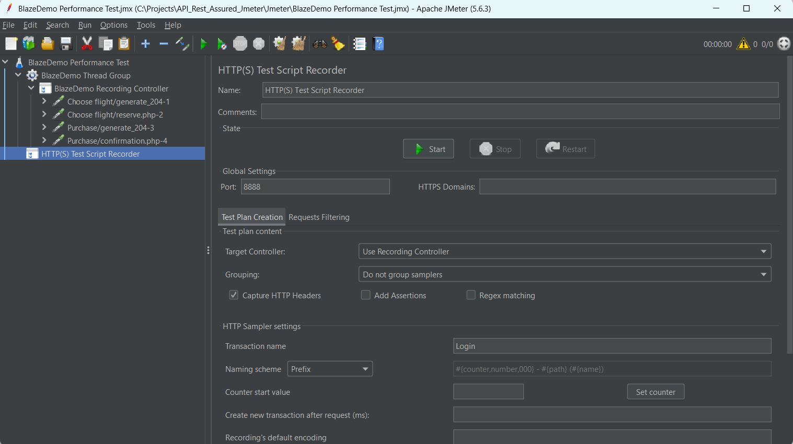
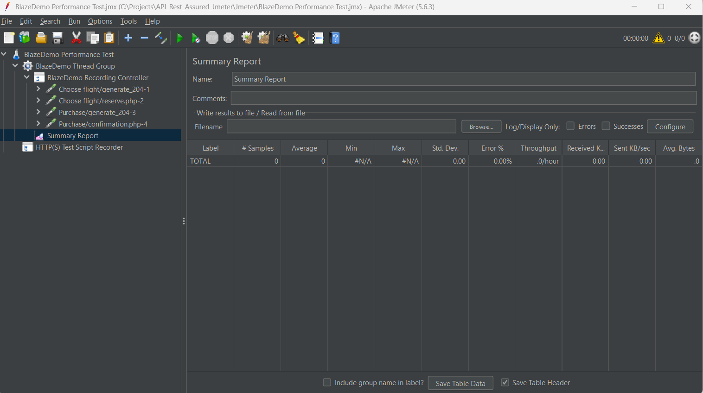
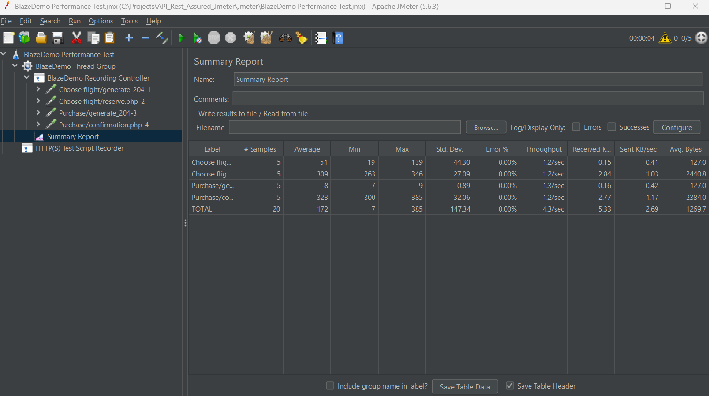

# 🚀 Jmeter-Performance-Testing
Apache JMeter Performance Testing Framework using BlazeDemo with HTTP(S) Test Script Recorder, Summary Reports and performance test evidence.

## 📌 Project Overview

This project demonstrates Apache JMeter Performance Testing using the BlazeDemo application.

The framework was created to simulate multiple users accessing the application and measure the response time and performance of each transaction.

The project also includes performance test evidence and screenshots demonstrating successful execution.

---

## 🛠️ Tools & Technologies

- Apache JMeter 5.6.3
- BlazeDemo
- HTTP(S) Test Script Recorder
- Summary Report Listener
- GitHub

---

## 📂 Project Structure

```text
JMeter-Performance-Testing
│
├── Jmeter
│   ├── BlazeDemo Performance Test.jmx
│   └── BlazeDemo_TestPlan.jmx
│
├── Evidence
│   ├── TC001_JMeter_TestPlan_Setup.png
│   ├── TC002_JMeter_ChooseFlight_Transaction.png
│   ├── TC003_JMeter_Purchase_Transaction.png
│   ├── TC004_JMeter_Login_Transaction.png
│   ├── TC005_JMeter_Recording_Controller.png
│   ├── TC006_JMeter_Summary_Report_Setup.png
│   └── TC007_JMeter_Summary_Report_Results.png
│
└── README.md
```

---

# 📋 Test Scenarios

### TC001 – Create JMeter Test Plan

- Create Performance Test Plan
- Configure Thread Group
- Configure Users
- Configure Ramp-Up Period

---

### TC002 – Record Choose Flight Transaction

- Configure HTTP(S) Test Script Recorder
- Record Choose Flight request
- Save transaction successfully

---

### TC003 – Record Purchase Transaction

- Record Purchase request
- Verify successful recording

---

### TC004 – Record Confirmation Transaction

- Record Purchase Confirmation
- Verify successful response

---

### TC005 – Configure Recording Controller

- Organise recorded requests
- Improve test plan structure

---

### TC006 – Configure Summary Report

- Add Summary Report Listener
- Configure performance metrics

---

### TC007 – Execute Performance Test

- Run performance test
- Verify successful execution
- Review Summary Report results
- 0% Errors recorded

---

# 📊 Performance Results

✔ Total Samples Executed

✔ Average Response Time

✔ Minimum Response Time

✔ Maximum Response Time

✔ Standard Deviation

✔ Throughput

✔ 0% Error Rate

---


# 📸 Test Evidence

## TC001 - JMeter Test Plan Setup



---

## TC002 - Choose Flight Transaction



---

## TC003 - Purchase Transaction



---

## TC004 - Confirmation Transaction



---

## TC005 - Recording Controller



---

## TC006 - Summary Report Setup



---

## TC007 - Summary Report Results



---

# ▶️ How to Run

1. Install Apache JMeter.
2. Open **BlazeDemo Performance Test.jmx**.
3. Start BlazeDemo.
4. Execute the Thread Group.
5. View the Summary Report.
6. Review the performance metrics.

---

# 🎯 Skills Demonstrated

- Apache JMeter
- Performance Testing
- HTTP(S) Test Script Recorder
- Thread Groups
- Summary Reports
- Transaction Recording
- Performance Analysis
- Test Evidence Documentation
- GitHub Project Management

---

## 👨‍💻 Author

**Krishan Shura**

Manual QA | Automation QA Engineer

Building practical Automation Testing projects using:

- Cypress
- Playwright
- JMeter
- Postman
- Rest Assured
